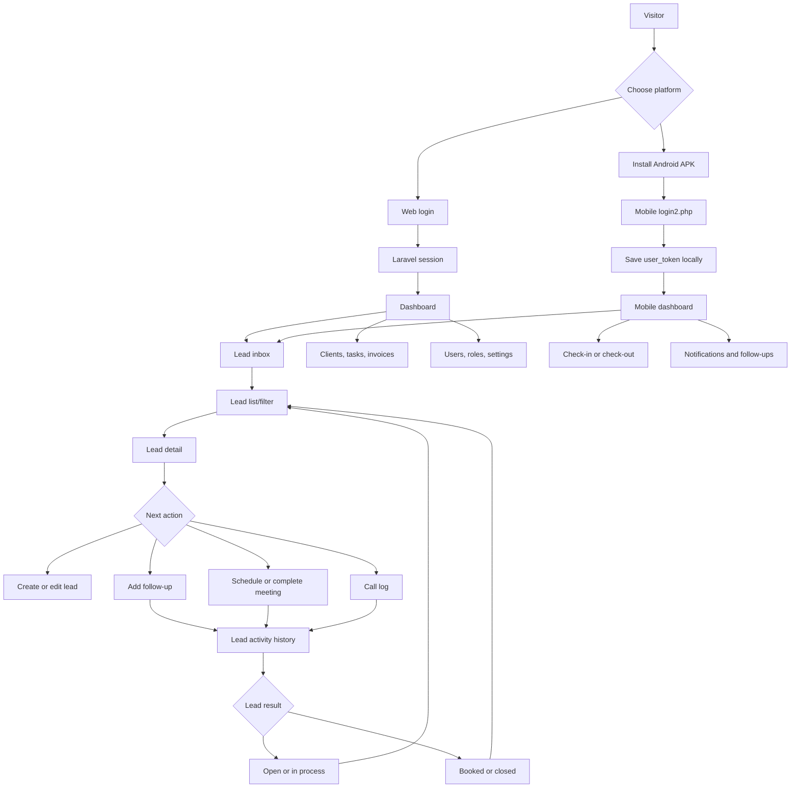

# Propfin CRM application flow

This document is the implementation flow for the current web application and the packaged mobile application. The web app uses Laravel routes and session authentication. The mobile APK currently uses the standalone PHP files under `API/` and sends a `key` value containing `users.user_token`.

## 1. System entry points

| User or system | Entry point | Authentication | First destination |
| --- | --- | --- | --- |
| Visitor | `/` | None | Marketing home |
| Company owner | `/register-company` | None, throttled submit | Company registration, then login |
| Web user | `/login` | Laravel session | `/dashboard` |
| Mobile user | `API/login2.php` | `mobile`, `pwd`, `pushtoken` | Mobile dashboard |
| Android installer | `/mobileapp/` | None | Download `Propfin.apk` |
| Scheduler | `POST /curl/scheduler/auto_assign` | `X-Scheduler-Token` or Bearer token | Assignment result |

## 2. Complete business flow

## 3. Web flow

### Public and authentication pages

1. `GET /` renders the marketing home.
2. `GET /register-company` renders company registration.
3. `POST /register-company` creates the company and user account. On validation failure, return to the form with errors.
4. `GET /login` renders the Laravel login form.
5. Successful login creates a session and redirects to `GET /dashboard`.
6. Failed login stays on the login page with an error.
7. `GET /logout` clears the session and returns to login.
8. Password reset uses the existing `auth/passwords/*` pages and Laravel auth routes.

### Authenticated landing flow

Every page below requires the `auth` middleware. The sidebar should use `/dashboard` as the home link and preserve the active company selected by `POST /active-company`.

| Area | Pages and actions |
| --- | --- |
| Dashboard | `/dashboard`, lead graph `/get-lead-graph-data`, notifications `/notifications/getall` |
| Leads | `/leads`, `/leads/create`, `/leads/{id}`, `/leads/{id}/edit`, `/leads/data`, status, assignment, follow-up, notes, meetings, bulk upload, export |
| Lead operations | `/new_sell_page`, `/all_sell_list`, `/get_sell_view`, `/all_meeting_and_visits`, `/call_logs`, dump/reverse lead actions |
| Clients | `/clients`, `/clients/create`, `/clients/{id}`, `/clients/{id}/edit`, documents, lead/task/invoice tabs, upload and assignment |
| Tasks | `/tasks`, `/tasks/create`, `/tasks/{id}`, `/tasks/{id}/edit`, status, assignment, time, comments, invoice conversion |
| Invoices | `/invoices`, `/invoices/{id}`, payment, reopen payment, sent/reopen sent, add item |
| Scheduling | `/scheduler`, `/scheduler/create`, `/scheduler/{id}/edit`, `/scheduler/list/ajax` |
| Administration | Users, roles, permissions, departments, company settings, platform companies |
| Master data | Projects, requirements, budgets, sources |
| HR and activity | `/attendance`, `/ta-da`, `/leaves`, notifications, integrations |

### Recommended web navigation sequence

`Login -> Dashboard -> Leads -> Lead detail -> Add follow-up/meeting -> Lead list -> Clients -> Tasks -> Invoices`.

Administration is a separate branch from the dashboard and should be visible only when the current user has the matching permission. The existing route file applies authentication globally, but authorization must be enforced by controller policy or permission middleware for each restricted action.

## 4. Mobile flow and current API contract

### Mobile startup

1. Open the APK.
2. If no saved token exists, show the mobile login page.
3. Send `POST API/login2.php` with `mobile`, `pwd`, and `pushtoken`.
4. A successful response is shaped like `{"record":[{"status":1,"Name":"...","key":"..."}]}`. Persist `key` securely.
5. A failed response has `status: 0`; remain on login.
6. For every authenticated request, send `key`. If the response says `You are not login` or the token is invalid, clear the saved token and return to login.

### Mobile pages and endpoints

| Mobile page/action | Endpoint | Required fields beyond `key` | Success payload |
| --- | --- | --- | --- |
| Dashboard counters | `API/LeadsCount.php` | None | `LeadCount` data and role information |
| Lead list | `API/Leads_list.php` | `status` (`1`, `2`, `3`, `4`, `5`, or daily values `6`-`9`) | `Lead_List` |
| Lead filters | `API/Leads_Filter.php` | `status` (`new`, `interested`, `meeting`, `visit`, `booked`) | `Lead_List` |
| Lead detail | `API/Leads_Detail.php` | `lead_id`, `lat`, `longt` | `DetailRecord` |
| New lead | `API/newlead.php` | `lat`, `longt`, `name`, `contact_no`, `email`, `country`, `state`, `city`, `Pincode`, `location`, `source`, `project`, `requrement`, `Budget`, `lead_type` | `lead_follow_up` |
| Edit lead | `API/leadupdate.php` | `lead_id`, `name`, `email`, `state`, `city`, `location`, `project`, `requirement`, `Budget`, `lead_type` | `Lead_updated` |
| Previous follow-ups | `API/previous_followup.php` | `lead_id`, `lat`, `longt` | `PreviousFollowup` |
| Add follow-up | `API/addnewfollowup.php` | `lead_id`, `follow_up_date`, `follow_up_status`, `comment`, `status`, `lat`, `longt` | `lead_follow_up` |
| Complete meeting | `API/addfollowupmeeting.php` | `follow_id`, `comment`, `senior_visit`, `meeting_type`, `follow_up_status`, `lat`, `longt` | `new_followup` |
| Lead status | `API/Lead_status.php` | `status`, `followid` | status result |
| Follow-up status | `API/LeadFollowup.php` | `status`, `followid` | follow-up result |
| Call log list/update | `API/userfollowups.php`, `API/calllogs.php`, `API/addcalllogs.php` | endpoint-specific `status`, `followid`, or call dates | endpoint-specific result |
| Notifications | `API/usernotifications.php`, `API/notification_read.php` | `status`, `followid` as applicable | `UserNotifications` or read result |
| Team/master data | `API/teams.php`, `API/Senior.php`, `API/Meeting_Type.php`, `API/master.php` | endpoint-specific fields | master data |
| Attendance status | `API/check_checkin.php` | `_Date` | attendance result |
| Check in/out | `API/employee_checkin_checkout.php` | `lat`, `lng`, `type`, remarks, addresses, dates | success/failure status |
| Attendance detail | `API/employee_checkinout_detail.php` | `_date` | `employeetrack` |

### Mobile lead lifecycle

1. Dashboard calls `LeadsCount.php`.
2. Selecting a counter calls `Leads_list.php` or `Leads_Filter.php`.
3. Selecting a lead calls `Leads_Detail.php` and `previous_followup.php`.
4. The user can edit with `leadupdate.php`, add a follow-up with `addnewfollowup.php`, or open a meeting action.
5. A meeting action updates the follow-up with `addfollowupmeeting.php`; status actions use `Lead_status.php` or `LeadFollowup.php`.
6. Refresh the list and dashboard counters after every successful mutation.
7. Notifications and pending follow-ups are loaded from their endpoints on dashboard refresh and after returning from a detail page.

## 5. API response and error rules

The current legacy endpoints do not share one response envelope. The mobile client must temporarily support these keys: `record`, `LeadCount`, `Lead_List`, `DetailRecord`, `PreviousFollowup`, `Userfollowups`, `UserNotifications`, `lead_follow_up`, `Lead_updated`, and `message`.

For every request:

1. Use HTTPS and `POST`.
2. Set a connection and response timeout.
3. Treat non-JSON, HTTP errors, and missing expected payloads as failures.
4. Never retry a mutation blindly. Retry reads only when safe.
5. On invalid token, clear local session and show login.
6. Show a confirmation after a successful mutation, then reload the affected page data.

## 6. Completion gaps to resolve

These items prevent the current flow from being fully reliable:

1. Laravel `routes/api.php` exposes only `/api/user`; mobile is coupled to legacy files under `API/`. Decide whether to keep that contract or migrate it into versioned Laravel API controllers.
2. `API/login2.php` echoes `in5` before JSON, which can break strict JSON parsing. Remove the debug output.
3. `API/employee_checkinout_detail.php` uses `$row['id']` although the fetched variable is `$rows`; attendance detail can return an invalid user query.
4. Standardize authentication. The web app uses Laravel sessions while mobile uses a mutable `user_token` stored on the user record.
5. Standardize response envelopes and HTTP status codes. Do not make the mobile app infer failure from message text.
6. Add authorization checks to every lead mutation so a valid token cannot update another user’s lead by ID.
7. Validate required fields and coordinates server-side, and use prepared statements throughout the legacy API.
8. Add automated request tests for login, expired token, lead CRUD, follow-up, meeting, check-in, and notification flows.
9. Configure the APK base URL per environment. The repository contains the APK but not its source, so mobile screen changes require the original mobile source project.

## 7. Definition of done

The app flow is complete when a test user can:

- register or be created by an administrator;
- log in successfully on web and mobile;
- see only the company and leads permitted for that user;
- create, edit, assign, filter, and open a lead;
- add a follow-up, record a call, schedule and complete a meeting;
- move a lead to booked or closed and see counters refresh;
- receive and mark notifications as read;
- check in, check out, and view attendance detail;
- create a client, task, document, and invoice from the web workflow;
- log out, receive a controlled expired-session response, and log in again.